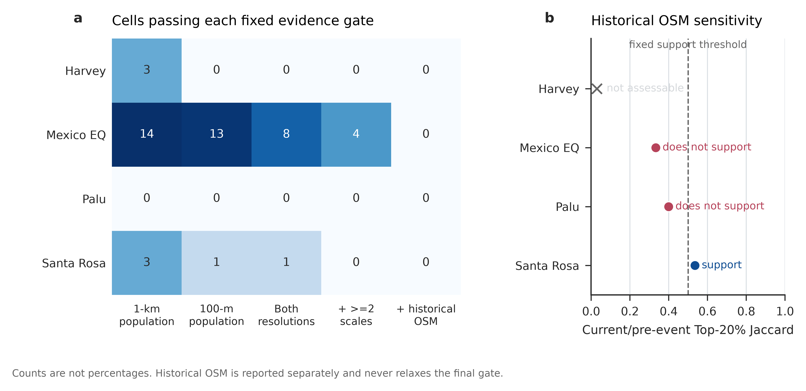

# Damage Is Not Need

<p>
  
  <strong>Auto-City-Research</strong>
</p>

<p>
  
  <strong>Code:</strong>
  <strong><a href="https://github.com/Ireliya/auto-city-research">github.com/Ireliya/auto-city-research</a></strong><br>
  
  <strong>Data:</strong>
  <strong><a href="https://huggingface.co/datasets/Ireliya/auto-city-research">huggingface.co/datasets/Ireliya/auto-city-research</a></strong>
</p>

**Damage Is Not Need: Auditing Post-Disaster Priority Disagreement with Multi-Source Urban Evidence**

Submission to [Urban Cup 2026 Competition 2](https://fi.ee.tsinghua.edu.cn/RSUSHD2026/).

## Research Question

Satellite damage assessment can rapidly locate physically affected buildings. This project asks a narrower urban AI question:

> If post-disaster places are ranked only by satellite-observed building damage, where does that ranking disagree with transparent multi-source priority scenarios, and which disagreements remain stable across alternative data and analytical choices?

We audit four xBD/xView2 event footprints using population exposure, road-access constraints, critical-service context, and descriptive urban form. The output is an auditable disagreement set for human review. It is not a ground-truth unmet-need model and not an operational dispatch system.

## Frozen Results

- **99,629** xBD/xView2 building records across **1,448** reference 500 m cells.
- WorldPop 100 m primary analysis: **73** percentile-consensus disagreements and **115** exact Top-20% disagreements.
- WorldPop 1 km comparison: **67** and **109**, respectively.
- **4** Mexico-earthquake cells pass all fixed non-temporal gates: at least 3/4 damage baselines, policy-weight disagreement probability at least 0.8, both population products, and spatial overlap at two or more scales.
- **0** of those four cells receive supportive historical OSM persistence evidence.
- Harvey boundary tests cover **149** SVI/NFIP tracts, **10,134** aggregated NFIP claims, and **41** FEMA RI-IHP ZIP aggregates. The proxy results are mixed and are reported as construct-specific evidence, not validation success.



The narrow conclusion is that damage-only and multi-source priorities can disagree, but apparent disagreements shrink sharply under fixed robustness and temporal checks. The workflow exposes that uncertainty instead of selecting one proxy as universally correct.

## One-Command Reproduction

```bash
git clone https://github.com/Ireliya/auto-city-research.git
cd auto-city-research

python -m pip install -r requirements.txt
python scripts/reproduce_core.py --profile final
```

The command downloads the immutable Hugging Face revision in `configs/public_release.yaml`, verifies `MANIFEST.csv`, runs the released-table smoke test, recomputes both population-resolution analyses and all three spatial scales, rebuilds the fixed consensus, verifies the four exact candidate keys, and regenerates Figures 11-12.

The reviewer route is CPU-only. It does not require raw satellite imagery, source population rasters, personal records, or a GPU.

For a faster released-table check:

```bash
python scripts/download_data.py
python scripts/smoke_reproduce.py
```

Expected final checks include:

```text
primary_100m_stable_mismatch_total: 73
strict_100m_top20_stable_mismatch_total: 115
final_consensus_candidates: 4
temporally_supported_final_candidates: 0
smoke reproduction OK
```

## Repository Map

```text
configs/       Fixed events, evidence gates, weights, and public revisions
scripts/       Download, manifest verification, smoke test, and final orchestrator
src/           Analysis, robustness, temporal audit, proxy tests, and figure code
reports/       English paper, Chinese report, figures, and rendered PDFs
records/       Final evidence freeze and claim-to-evidence ledgers
data/          Source ledger and download notes; derived data arrives from Hugging Face
```

The deterministic public route uses prepared, privacy-safe derived inputs. Network-dependent source acquisition remains separately callable through the relevant source scripts and is not treated as deterministic CI.

## Data And Privacy

The paired [Hugging Face dataset](https://huggingface.co/datasets/Ireliya/auto-city-research) includes derived grids, aggregated validation tables, figures, reports, and evidence records. It excludes raw xBD imagery, raw WorldPop rasters, bulk OSM caches, individual insurance claims, person-level assistance records, credentials, and private infrastructure paths.

See [DATASET.md](DATASET.md) and [reports/data_access_license_notes.md](reports/data_access_license_notes.md) for source-specific licensing and redistribution boundaries.

## Reports

- [English research paper](reports/pdf/paper_en.pdf)
- [Chinese competition report](reports/pdf/competition_report_cn.pdf)
- [Data and reproducible-code guide](reports/pdf/data_description_reproducibility.pdf)
- [AI collaboration record](reports/pdf/ai_collaboration_summary_cn.pdf)

## Citation

```text
Auto-City-Research. Damage Is Not Need: Auditing Post-Disaster Priority Disagreement with Multi-Source Urban Evidence. Urban Cup 2026 Competition 2.
```

Code is released under the MIT License. Derived artifacts remain subject to the upstream terms documented in the data notes.
