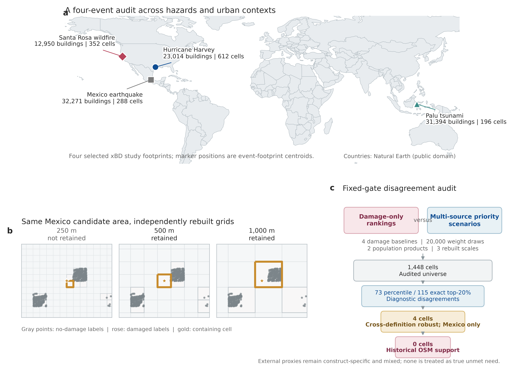

# 损毁不等于需求：基于多源城市证据的灾后优先级分歧审计

队伍：**Auto-City-Research**

代码：[github.com/Ireliya/auto-city-research](https://github.com/Ireliya/auto-city-research)

复现数据：[huggingface.co/datasets/Ireliya/auto-city-research](https://huggingface.co/datasets/Ireliya/auto-city-research)

项目网站：[ireliya.github.io/auto-city-research](https://ireliya.github.io/auto-city-research/)

## 摘要

灾后遥感能够快速识别建筑物理损毁，但“哪里损毁最重”并不等于“哪里应优先获得救援或恢复资源”。本研究不训练一个所谓的真实需求模型，而是建立一套可审计的优先级分歧流程：比较只依赖 xBD/xView2 建筑损毁的排序，与同时考虑人口暴露、道路可达约束和关键设施条件的多源优先级情景，并进一步检验这些分歧能否跨损毁定义、政策权重、人口产品和空间尺度保持稳定。

研究整合 4 场灾害、99,629 栋 xBD 建筑和 1,448 个 500 米网格。以质检通过的 WorldPop 100 米人口数据为主分析时，百分位规则识别出 73 个情景共识分歧网格，严格 Top-20% 预算识别出 115 个。但这些只是待审计候选。应用预先固定的四类损毁基线、10,000 组政策合理权重、100 米与 1 公里两种人口产品、250/500/1,000 米三种重建尺度后，仅有墨西哥地震的 4 个网格通过全部门槛。四个网格在两种人口产品中都得到 4/4 损毁基线支持，政策权重分歧概率为 0.812--0.959，并同时出现在 500 米与 1,000 米尺度。然而，灾前历史 OSM 不支持这 4 个网格的时间稳定性。

Harvey 外部代理检验进一步说明“代理不同，答案不同”：CDC SVI 对两类排序都没有明确相关；FEMA RI-IHP 在 14 个高覆盖 ZIP 上对平衡多源情景的点估计略高，但区间很宽；10,134 条 NFIP 保险索赔聚合到 149 个 tract 后，相关性反而更支持损毁排序。因此，本研究的贡献不是自动分配资源，而是一套把分歧、稳健性、时间敏感性和代理构念边界同时暴露给人工复核的城市 AI 审计框架。

## 1. 研究问题与主张边界

本研究的问题是：

> 如果一个灾后城市 AI 只依据遥感影像中的建筑损毁来安排优先级，它会在哪些地方与多源城市证据产生分歧？哪些分歧能够跨数据和分析选择保持稳定？

全文使用四个固定术语：

- **损毁优先级**：仅按 xBD 建筑物理损毁对同一事件内的网格排序。
- **多源优先级情景**：透明组合损毁、人口、道路和关键设施的政策情景。
- **分歧网格**：被多源情景选入、但被损毁预算遗漏的网格。
- **稳健分歧**：同时通过损毁基线、权重、人口分辨率和空间尺度固定门槛的 500 米网格。

“稳健”只表示对这些分析选择稳定，不表示已经观测到真实未满足需求。本研究不声称找到了唯一正确的救援排序，也不建议自动化派单。

## 2. 数据与证据角色

### 2.1 xBD/xView2 建筑损毁

研究使用 Hurricane Harvey、Mexico earthquake、Palu tsunami 和 Santa Rosa wildfire 四个事件。

| 事件 | 建筑数 | 500 米网格数 | Destroyed | Major | Minor | No damage |
| --- | ---: | ---: | ---: | ---: | ---: | ---: |
| Harvey | 23,014 | 612 | 401 | 8,238 | 2,663 | 11,423 |
| Mexico earthquake | 32,271 | 288 | 2 | 18 | 110 | 32,066 |
| Palu | 31,394 | 196 | 4,966 | 571 | 1 | 25,455 |
| Santa Rosa | 12,950 | 352 | 3,471 | 63 | 78 | 9,285 |
| **合计** | **99,629** | **1,448** | **8,840** | **8,890** | **2,852** | **78,229** |

墨西哥事件中 99.6% 的建筑为 `no-damage`，因此损毁排序存在大量并列。这一事件用于检验：当损毁信号缺乏区分度时，简单百分位排序是否会失效。

### 2.2 WorldPop、OSM 与城市形态

主分析使用事件年份的 WorldPop 100 米人口栅格，并将 1 公里产品保留为分辨率对照。1,448 个共同网格全部匹配，100 米数据没有缺失、非有限值或负数。两种产品的网格秩相关为 0.738--0.860，但事件人口总量相差 22.7%--56.6%，人口 Top-20% 集合的 Jaccard 仅为 0.456--0.600。这说明两种数据相关但不可互换。

当前 OSM 提供道路、医院、诊所、避难所、消防、警察、药房等设施，以及独立建筑轮廓。道路和设施进入多源情景；OSM 建筑只用于事后解释，不反向改变优先级。ohsome API 提供每场灾害发生前的道路、设施与建筑快照，失败请求不会被写成零值。

### 2.3 三类 Harvey 外部代理

- **CDC SVI 2016**：149 个相交 tract 的社会脆弱性代理。
- **FEMA RI-IHP**：DR4332 Texas 的注册、资格、住房援助和其他需求援助。只使用 `RegistrationIntakeIndividualsHouseholdPrograms` 一张表，并按 ZIP 仅聚合一次。
- **NFIP Claims v2**：149 个 tract、10,134 条 Harvey 时段保险索赔，报告损失 15.94 亿美元、赔付 14.69 亿美元。

三者分别衡量社会脆弱性、行政援助记录和参保财产损失，均不是真实未满足需求标签。公开材料只保留聚合结果，不发布个人记录。

## 3. 方法：从候选分歧到固定门槛审计

### 3.1 四种损毁排序

研究比较四种只看物理损毁的基线：面积加权平均损毁等级、损毁加权建筑面积、受损建筑数量、严重或毁坏建筑数量。严格预算中，每个事件恰好选择 `ceil(n × share)` 个网格，只有在实质指标完全并列时才用 `cell_id` 做确定性排序。

### 3.2 三个多源优先级情景

所有指标在事件内归一化。三个情景的权重固定如下：

| 情景 | 损毁 | 人口 | 道路约束 | 服务约束 |
| --- | ---: | ---: | ---: | ---: |
| 平衡 | 0.40 | 0.35 | 0.15 | 0.10 |
| 人口敏感 | 0.25 | 0.55 | 0.10 | 0.10 |
| 可达性敏感 | 0.25 | 0.30 | 0.30 | 0.15 |

当一个网格至少被两个多源情景选入、同时不在损毁 Top 集合中时，它被标记为情景共识分歧。该分数是透明政策情景，不是从真实需求标签学习得到的预测。

### 3.3 权重、人口和尺度稳健性

研究固定随机种子 `20260715`，抽取 10,000 组无约束 Dirichlet 权重和 10,000 组政策合理权重。政策合理区间要求损毁权重为 0.20--0.50，其余指标均不低于 0.05。空间尺度不是复制原 500 米结果，而是从建筑级表重新构建 250、500 和 1,000 米网格，并重新连接 WorldPop 与 OSM。

### 3.4 最终稳健分歧门槛

严格 Top-20% 预算下，一个 500 米网格必须同时满足：

1. 至少 3/4 个损毁基线支持；
2. 政策合理权重下分歧概率不低于 0.80；
3. 上述两项在 100 米和 1 公里两种人口产品中都成立；
4. 至少两个空间尺度与该 500 米网格存在不低于 50% 的面积重叠。

门槛在查看最终候选身份前固定，不能为了增加候选数量而降低。

### 3.5 历史 OSM 与外部代理

历史 OSM 只有在灾前道路和设施非零覆盖均达到当前数据的 50% 时才可判定；当前与灾前分歧集合 Jaccard 不低于 0.50 才记为“支持”。否则记为“不支持”或“无法判定”。

SVI、RI-IHP 和 NFIP 均计算 Spearman、Kendall、NDCG@20% 和 Top-20% recall，并进行 1,000 次地理单元 bootstrap。RI-IHP 主比较要求 xBD 覆盖 ZIP 面积至少 10%，同时报告 0%、5%、10% 和 20% 的敏感性。

## 4. 结果

### 4.1 主分析显示分歧具有事件差异

100 米人口主分析的百分位规则识别出 73 个情景共识分歧网格：Harvey 49 个、Mexico 0 个、Palu 2 个、Santa Rosa 22 个。对应暴露人口为 Harvey 24,460、Palu 2,161、Santa Rosa 3,023。人口敏感情景单独识别出 Harvey 69 个、Santa Rosa 45 个分歧，说明政策权重会明显改变候选规模。

Harvey 分歧网格相对其他 Harvey 网格具有更高人口、更多建筑和更大建筑面积；Santa Rosa 分歧网格则道路密度更低、关键设施更少、设施距离更远。两者提示不同的城市情境，但不构成因果解释。

### 4.2 严格预算揭示墨西哥并列边界

严格 Top-20% 预算下共有 115 个分歧网格：Harvey 52、Mexico 39、Palu 2、Santa Rosa 22。墨西哥从百分位规则的 0 个变为 39 个，是因为百分位规则把大量并列的近零损毁网格全部纳入损毁 Top 集合，而严格预算只允许 58/288 个网格进入。这是损毁排序缺乏区分度的诊断，不是 39 个真实需求地区的证明。

### 4.3 损毁定义与政策权重会改变分歧规模

四种损毁基线下，Top-20% 分歧数量范围为：Harvey 23--52、Mexico 27--43、Palu 2--22、Santa Rosa 22--40。10,000 组政策合理权重的分歧数量中位数和 95% 经验区间分别为 Harvey 48 [35, 71]、Mexico 40 [35, 46]、Palu 4 [1, 13]、Santa Rosa 22 [13, 42]。

### 4.4 空间尺度与人口产品都是实质不确定性

在 100 米人口主分析中，Harvey 的 250/500/1,000 米分歧数为 103/52/27，Mexico 为 82/39/9，Palu 为 4/2/1，Santa Rosa 为 74/22/7。面积占比比数量更稳定，但仍然变化：Harvey 为 7.7%--9.6%，Mexico 为 6.8%--13.5%，Palu 为 0.8%--1.2%，Santa Rosa 为 5.0%--8.4%。

### 4.5 固定门槛后只剩 4 个稳健分歧

最终门槛将候选集大幅缩小。Harvey、Palu 和 Santa Rosa 均为 0，Mexico 保留 4 个：

| 网格 | 1 公里产品人口 | 100 米产品人口 | 两产品损毁基线支持 | 政策分歧概率（1 公里 / 100 米） | 两产品共同尺度 |
| --- | ---: | ---: | ---: | ---: | --- |
| `mexico-earthquake_500m_3_38` | 1,923.91 | 2,208.33 | 4 / 4 | 0.862 / 0.812 | 500、1,000 米 |
| `mexico-earthquake_500m_17_2` | 296.68 | 274.78 | 4 / 4 | 0.959 / 0.927 | 500、1,000 米 |
| `mexico-earthquake_500m_17_3` | 296.68 | 100.12 | 4 / 4 | 0.956 / 0.846 | 500、1,000 米 |
| `mexico-earthquake_500m_18_3` | 284.85 | 227.03 | 4 / 4 | 0.942 / 0.889 | 500、1,000 米 |

这 4 个网格只代表跨定义稳定的排序分歧，不代表已经验证的需求地区。

### 4.6 NFIP 更支持物理损毁排序

NFIP 参保财产损失没有把多源情景验证为真实需求。149 个 tract 中，赔付金额与损毁等级的 Spearman 为 0.591 [0.482, 0.686]，与平衡多源情景为 0.450 [0.304, 0.572]。平衡多源情景的 NDCG 点估计略高（0.561 对 0.510），但不足以扭转相关性结果。NFIP 衡量参保财产损失，因此更接近物理损毁是符合构念预期的。

### 4.7 历史 OSM 不支持这 4 个候选

Santa Rosa 的事件级当前/灾前分歧 Jaccard 为 0.536，达到支持阈值，但它没有网格通过最终跨定义门槛。Mexico 的 Jaccard 为 0.333，Palu 为 0.400，均记为“不支持”。Harvey 的历史设施覆盖率为 0.491，略低于固定的 0.50，记为“无法判定”，而不是补零。

4 个 Mexico 候选的历史 OSM 标志均为“不支持”。因此，最终结果是 4 个跨定义稳健分歧、0 个得到时间稳定性支持的稳健分歧。

### 4.8 外部代理没有选出唯一正确排序

SVI 总体脆弱性上，损毁排序为 -0.144 [-0.296, 0.013]，平衡多源情景为 0.022 [-0.141, 0.180]，两者均不明确。RI-IHP 10% 覆盖阈值只剩 14 个 ZIP：有效注册数相关性从 0.503 提高到 0.569，符合资格援助金额从 0.851 提高到 0.868，每千人注册率从 0.473 提高到 0.556，但区间宽且大量重叠。

## 5. 城市科学意义

本研究的核心发现不是“多源分数优于损毁分数”，而是“优先级结论必须经过分歧审计”。初始候选很多，跨基线、权重、人口和尺度后只剩 4 个；加入历史 OSM 后又没有一个得到时间支持。这个收缩过程揭示了哪些结论依赖分析选择，也阻止研究者把方便的数据代理包装成真实需求。

该框架对城市 AI 有三点启示。第一，物理损毁感知与资源优先级判断应当作为两个独立层。第二，政策价值选择应以透明情景和概率呈现，而不是隐藏在一个标量中。第三，每个候选应携带损毁、权重、人口、尺度、时间和外部代理证据标志，交由人工结合现场信息复核。

## 6. 本次提交已解决的问题

本次提交已经完成：WorldPop 100 米全量下载与四事件重算；1 公里人口产品对照；250/500/1,000 米独立重建；四种损毁基线与 20,000 组权重；灾前历史 OSM；CDC SVI；单表 RI-IHP；NFIP；1,000 次 bootstrap；固定门槛共识审计；12 张可编辑 SVG/PDF、600 dpi PNG 和 RGB 灰度图；统一复现入口、哈希、证据索引和全过程 AI 协作记录。

负面或混合结果没有被删除。Harvey 历史 OSM 无法判定、Mexico/Palu 时间证据不支持、NFIP 更偏向损毁排序，均保留在主报告中。

## 7. 剩余有效性边界

本研究没有跨四事件的真实未满足需求标签，因此不能验证任何排序是“正确答案”。xBD 覆盖的是抽样灾害范围，损毁标签也可能存在误差。WorldPop 产品采用不同人口分配方法，OSM 完整性随地区和时间变化，历史地图还受志愿者编辑活动影响。

空间网格存在可变空间单元问题。多尺度重建减少了对单一尺度的依赖，但不能让网格身份与尺度无关。SVI、RI-IHP 和 NFIP 还分别受到社会指标定义、项目资格与参与、保险覆盖与赔付机制影响。

因此，本研究适用于发现值得复核的排序分歧，不适用于自动救援派单、福利资格判定或替代本地现场评估。

## 8. AI 协作与公开复现

AI 参与研究问题收敛、数据发现、代码编写、失败诊断、数值核验、图表修改和文本重构；人类负责确定问题边界、批准保守门槛、拒绝过度结论、要求保留负面结果，并决定公开数据范围。所有关键决策分别记录在：

- `logs/research_log.md`
- `logs/ai_collaboration_log.md`
- `logs/command_log.md`
- `records/evidence_index.csv`

公开复现入口为 `scripts/reproduce_core.py`。`configs/final_evidence.yaml` 固定最终门槛，`src/21_regenerate_publication_figures.py` 从公开派生表重建 12 张图，`src/24_build_final_consensus.py` 重建 4 个最终候选。主分析使用服务器 `city` 环境和 CPU。公开包不重新分发 xBD 原始遥感影像、WorldPop 原始大栅格或 FEMA 个人记录。
