# Damage Is Not Need: Auditing Post-Disaster Priority Disagreement with Multi-Source Urban Evidence

Team: **Auto-City-Research**

Code: [github.com/Ireliya/auto-city-research](https://github.com/Ireliya/auto-city-research)

Reproducibility data: [huggingface.co/datasets/Ireliya/auto-city-research](https://huggingface.co/datasets/Ireliya/auto-city-research)

## Abstract

Satellite damage assessment can rapidly map physically affected buildings, but a damage map is not a complete recovery-priority map. We tested where damage-only rankings disagree with transparent multi-source priority scenarios that also represent population exposure, road-access constraints, and critical-service context. The analysis joined 99,629 xBD/xView2 building labels with WorldPop and OpenStreetMap evidence across 1,448 500 m cells in four disasters. With quality-controlled 100 m WorldPop data as the primary population surface, a percentile rule identified 73 scenario-consensus disagreement cells; an exact top-20% budget identified 115. These totals were diagnostic rather than final findings. We then imposed fixed gates across four damage baselines, 10,000 policy-plausible weight samples, both 100 m and 1 km population products, and independently rebuilt 250, 500, and 1,000 m grids. Only four Mexico-earthquake cells passed every gate. All four were supported by all damage baselines in both population products, had policy-weight disagreement probabilities of 0.812--0.959, and persisted at 500 and 1,000 m. Historical OpenStreetMap did not support their temporal persistence. External tests also diverged by construct: CDC social vulnerability showed no decisive alignment, FEMA household-assistance indicators slightly favored a balanced multi-source scenario but had wide intervals over 14 ZIP codes, and 10,134 Harvey-period flood-insurance claims over 149 tracts favored damage-only rankings on rank correlation. We therefore do not claim to estimate true unmet need. The contribution is a reproducible disagreement audit that separates physical damage observation, normative priority scenarios, temporal data sensitivity, and construct-specific external evidence before human review.

## 1. Introduction

Rapid damage mapping is an important application of remote sensing after disasters. Satellite imagery can cover large affected areas when field access is constrained, and datasets such as xBD support building-level damage assessment from pre- and post-event imagery [@gupta2019xbd]. A natural downstream step is to aggregate those labels and rank places by visible damage. This ranking is useful for situational awareness, but it becomes a different decision problem when interpreted as rescue or recovery priority.

Recovery priority depends on more than physical damage. A densely populated cell with moderate damage, weak road access, or limited critical services may warrant review even when it is not among the most visibly damaged locations. Social-vulnerability research likewise shows that hazard impacts depend on place-based social conditions [@cutter2003social]. Post-Disaster Needs Assessment guidance separates damages and losses from recovery needs, while the Sendai Framework treats risk as a combination of physical, social, economic, cultural, and environmental conditions [@undp2015pdna; @undrr2015sendai]. These frameworks do not provide one universally correct ranking, but they make clear that damage and need are not interchangeable constructs.

Multi-source urban data can reveal this distinction, yet it can also create false confidence. WorldPop provides gridded population estimates [@lloyd2017high; @worldpop2026global1]. OpenStreetMap (OSM) provides roads, facilities, and buildings that can be queried through tools such as OSMnx [@openstreetmap2026data; @boeing2017osmnx; @boeing2025modeling]. CDC Social Vulnerability Index (SVI), FEMA Registration Intake and Individuals and Households Program (RI-IHP), and National Flood Insurance Program (NFIP) records provide additional social, administrative, and insured-loss proxies [@cdc2026svi2016; @fema2026riihp; @fema2026nfipclaims]. None is a direct label of unmet need. Population surfaces differ by resolution, current OSM may not represent the pre-disaster city, and administrative outcomes reflect program eligibility and participation. A multi-source ranking is therefore not automatically more valid than a damage-only ranking.

We address this problem as a disagreement audit. The audit asks where a damage-only inspection budget omits cells selected by multiple transparent priority scenarios, then subjects those cells to fixed tests across damage definitions, policy weights, population products, spatial scales, historical map evidence, and external proxies. This design shifts the objective from producing a single supposedly correct score to identifying which disagreements survive reasonable changes in observable evidence.

The evidence supports a narrow conclusion. The primary 100 m analysis produces many provisional disagreements, but only four cells pass all fixed cross-definition gates. Historical OSM does not support their temporal persistence, and external proxies disagree about which ranking aligns best. The study therefore contributes an auditable procedure for locating and qualifying priority disagreement, not an operational dispatch model or a validated estimator of true unmet need.

## 2. Research Question and Claim Boundary

The research question is:

> If an urban AI workflow ranks post-disaster places only by satellite-observed building damage, where does that ranking disagree with multi-source priority scenarios, and which disagreements remain stable across alternative data and analytical choices?

The primary unit is an event-specific grid cell. A **damage-only priority** ranks cells using one physical-damage measure. A **multi-source priority scenario** combines damage with population exposure, road-access constraints, and critical-service context. A **disagreement cell** is selected by multi-source scenarios but omitted by the damage-only inspection budget. The term **robust disagreement** is reserved for a cell that passes every fixed baseline, weight, population-resolution, and spatial-scale gate.

This terminology sets the claim boundary. The analysis observes disagreement among rankings. It does not observe unmet need, identify the ethically correct allocation, or estimate the causal effect of urban form on disaster outcomes.

## 3. Data

### 3.1 Damage and Study Events

xBD/xView2 supplies building polygons and ordinal post-disaster damage labels [@gupta2019xbd]. Four events were selected to represent different hazards and urban contexts while retaining complete label access.

| Event | Labeled buildings | 500 m cells | Destroyed | Major damage | Minor damage | No damage |
| --- | ---: | ---: | ---: | ---: | ---: | ---: |
| Hurricane Harvey | 23,014 | 612 | 401 | 8,238 | 2,663 | 11,423 |
| Mexico earthquake | 32,271 | 288 | 2 | 18 | 110 | 32,066 |
| Palu tsunami | 31,394 | 196 | 4,966 | 571 | 1 | 25,455 |
| Santa Rosa wildfire | 12,950 | 352 | 3,471 | 63 | 78 | 9,285 |
| **Total** | **99,629** | **1,448** | **8,840** | **8,890** | **2,852** | **78,229** |

The Mexico footprint is a useful boundary case because 99.6% of labeled buildings are classified as no damage. Damage rankings therefore contain many ties even though multi-source indicators vary substantially.

### 3.2 Population, Roads, Services, and Urban Form

The primary population surface uses event-year WorldPop 100 m population-count rasters aggregated to each grid. A separate 1 km WorldPop product is retained for population-resolution sensitivity. Across the 1,448 common 500 m cells, the 100 m tables contain no missing, non-finite, or negative values. Event-level cell-rank correlations between the two products range from 0.738 to 0.860, but population totals differ by 22.7--56.6% and population top-20% Jaccard overlap ranges from 0.456 to 0.600. These products therefore provide related but non-interchangeable exposure evidence.

Current OSM supplies road geometries and critical facilities, including hospitals, clinics, shelters, fire stations, police, pharmacies, and related public-service features when mapped [@openstreetmap2026data; @overpass2026api]. Road length per square kilometre represents local network supply. Facility count and distance to the nearest facility represent service context. Current OSM building footprints provide an independent descriptive urban-form layer; they are not included in the priority score.

Historical OSM snapshots are retrieved through the ohsome API at the last date before each disaster [@ohsome2026api]. The snapshots are 24 August 2017 for Harvey, 18 September 2017 for Mexico, 27 September 2018 for Palu, and 7 October 2017 for Santa Rosa. Failed requests are recorded as failures rather than converted to zero.

### 3.3 Construct-Specific External Proxies

Three external families are used for Hurricane Harvey because they measure different outcomes.

- **CDC SVI 2016** provides tract-level overall and theme-specific social-vulnerability ranks for 149 intersecting tracts [@cdc2026svi2016].
- **FEMA RI-IHP** provides ZIP-level registrations, eligibility, housing assistance, and other-needs assistance for disaster 4332 in Texas [@fema2026riihp]. Only the `RegistrationIntakeIndividualsHouseholdPrograms` table is used, and each variable is aggregated once by ZIP to avoid owner/renter double counting.
- **NFIP Claims v2** provides Harvey-period insured claim counts, reported losses, and paid amounts [@fema2026nfipclaims]. The study contains 10,134 claims over 149 intersecting tracts, USD 1.594 billion in reported damage, and USD 1.469 billion in paid amounts.

Only aggregate outputs are retained. No individual insurance or assistance records are published.

## 4. Audit Method

### 4.1 Damage-Only Rankings

Each building label is mapped to ordinal severity and aggregated within event-specific grids. Four damage-only baselines are evaluated:

1. area-weighted mean severity;
2. damage-weighted building area;
3. damaged-building count; and
4. severe-or-destroyed building count.

The first is the primary damage index. For operational consistency, strict budgets contain exactly `ceil(n * share)` cells per event. Cells are sorted by the substantive score and then by `cell_id` only as a deterministic final tie-break.

### 4.2 Multi-Source Priority Scenarios

Four indicators are normalized within each event: damage, `log1p` population, inverse `log1p` road density, and a service-constraint indicator averaging normalized facility distance and inverse facility count. Three transparent scenarios are fixed in `configs/weight_scenarios.yaml`.

| Scenario | Damage | Population | Access constraint | Service constraint |
| --- | ---: | ---: | ---: | ---: |
| Balanced | 0.40 | 0.35 | 0.15 | 0.10 |
| Population-sensitive | 0.25 | 0.55 | 0.10 | 0.10 |
| Accessibility-sensitive | 0.25 | 0.30 | 0.30 | 0.15 |

For cell `i` and scenario `s`, the score is

```text
S_i,s = w_D D_i + w_P P_i + w_A A_i + w_S C_i.
```

The score is a scenario, not a learned estimate of true need. A scenario-consensus disagreement requires selection by at least two of the three multi-source top sets while remaining outside the damage-only top set.

### 4.3 Diagnostic Rules and Weight Uncertainty

The first diagnostic uses event-wise top-20% percentile flags. A second rule uses exact top-k sets at 10%, 15%, 20%, 25%, and 30% inspection budgets. The exact rule is central to later gates because it prevents low-damage ties from expanding a top set beyond the stated budget.

Weight uncertainty is evaluated with seed `20260715`. The workflow draws 10,000 unconstrained vectors from `Dirichlet(1,1,1,1)` and 10,000 policy-plausible vectors in which damage receives 0.20--0.50 and every other indicator receives at least 0.05. For each cell, it records the probability that a sampled multi-source score selects the cell while the primary exact damage budget omits it.

### 4.4 Population and Spatial-Scale Sensitivity

The complete analysis is repeated with both WorldPop products. Spatial sensitivity is evaluated on independently rebuilt 250, 500, and 1,000 m grids. Building-level xBD records are reaggregated, and population and OSM context are rejoined at each scale. Existing 500 m cells are never split or duplicated to simulate another resolution.

### 4.5 Fixed Robust-Disagreement Gates

The final gate was fixed before inspecting the final candidate identities. At a strict top-20% budget, a 500 m cell must satisfy all conditions:

1. at least three of four damage baselines support disagreement;
2. policy-plausible disagreement probability is at least 0.80;
3. conditions 1 and 2 hold with both the 100 m and 1 km population products; and
4. corresponding disagreement areas overlap by at least 50% at two or more of the 250, 500, and 1,000 m scales.

No threshold is lowered to increase the candidate count. Historical OSM is reported separately because map completeness and temporal persistence are distinct from the cross-definition gate.

### 4.6 Historical OSM and External Proxy Tests

Historical OSM is assessable only when pre-event road and facility nonzero-cell coverage each reaches at least 50% of current coverage. Event-level support additionally requires a current-versus-pre-event disagreement Jaccard of at least 0.50. The output is a three-state result: `support`, `does_not_support`, or `not_assessable`.

External rankings are aggregated to Census tracts or ZIP codes by spatial overlap. We report Spearman correlation, Kendall correlation, NDCG at 20%, and top-20% recall. Each proxy uses 1,000 geographic bootstrap samples with seed `20260715`. RI-IHP is reported at ZIP coverage thresholds of 0%, 5%, 10%, and 20%; the main comparison uses 10% coverage. Confidence intervals and sample sizes accompany every metric.

## 5. Results

### 5.1 The Primary Analysis Produces Provisional, Event-Specific Disagreements

The primary 100 m population analysis identified 73 percentile-rule disagreement cells: 49 in Harvey, none in Mexico, two in Palu, and 22 in Santa Rosa. These cells contained an estimated 24,460 people in Harvey, 2,161 in Palu, and 3,023 in Santa Rosa. Scenario choice changed the provisional counts. Harvey ranged from 39 accessibility-sensitive disagreements to 69 population-sensitive disagreements; Santa Rosa ranged from 22 to 45.

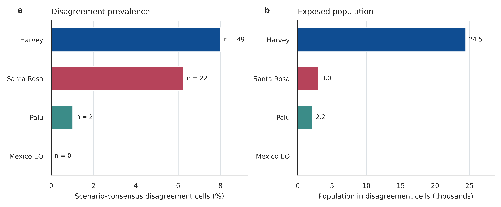

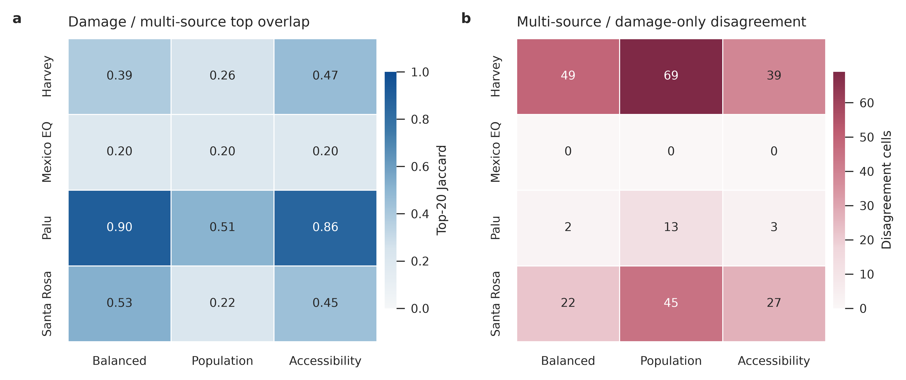

The driver profiles were also event-specific. Harvey disagreement cells had higher population exposure (standardized mean difference 0.47), building count (1.07), and mapped building area (0.93) than other Harvey cells. Santa Rosa disagreement cells had lower road density (-0.29), fewer facilities (-0.46), and greater facility distance (0.49). These descriptive contrasts support distinct dense-form and service-access interpretations, but they do not establish causal mechanisms.

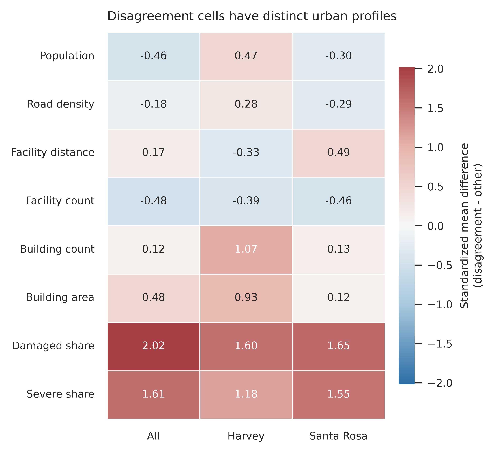

Figure 4 places the two largest provisional patterns on an OSM geographic background. The same outlined cells are shown under damage-only and mean multi-source scores, making the ranking conflict directly inspectable.

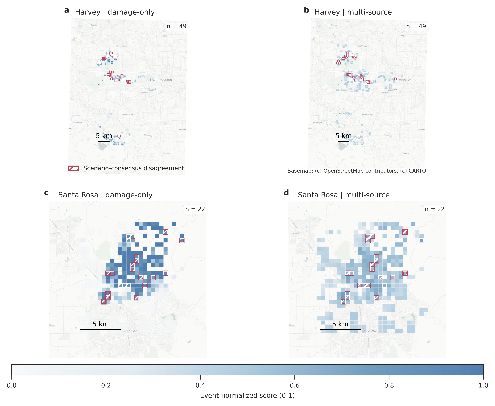

### 5.2 Exact Budgets Expose the Mexico Tie Boundary

Threshold sensitivity changed the number of provisional disagreement cells but did not remove the Harvey and Santa Rosa signals. Under a strict top-20% budget, the total increased from 73 percentile-rule cells to 115 exact-budget cells: 52 in Harvey, 39 in Mexico, two in Palu, and 22 in Santa Rosa.

Mexico changed most because the percentile damage rule admitted all tied near-zero cells into the damage top set. An exact budget retained 58 of 288 cells and exposed 39 multi-source selections outside that set. This is a ranking-tie diagnostic, not evidence that those 39 cells represent verified need.

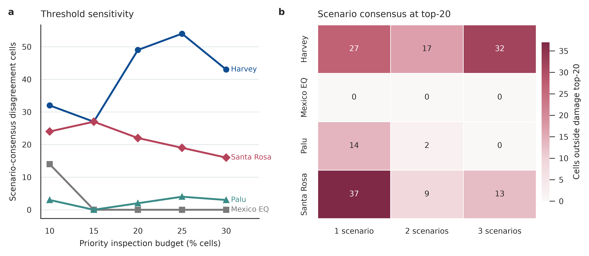

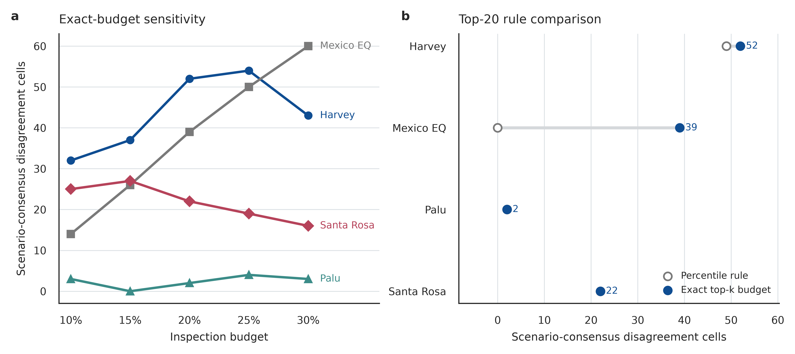

### 5.3 Building Form, Damage Definitions, and Weights Change the Signal

Current OSM building footprints produced an independent urban-form profile. Harvey disagreement cells remained denser in OSM building measures, whereas Santa Rosa disagreement cells were less built up than other event cells. OSM building area fraction and xBD mapped building area were positively correlated in all events, with Spearman correlations from 0.21 in Mexico to 0.79 in Palu. This supports the use of xBD building area as a descriptive form proxy while also showing that disagreement is not equivalent to density.

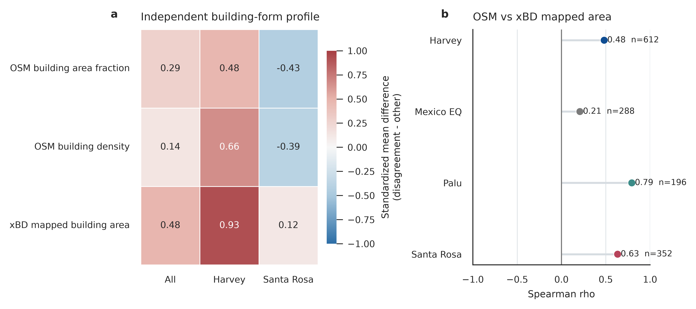

At the exact top-20% budget, disagreement counts varied substantially across damage baselines. Harvey ranged from 23 to 52 cells, Mexico from 27 to 43, Palu from 2 to 22, and Santa Rosa from 22 to 40. Under 10,000 policy-plausible weights, median counts and 95% empirical intervals were 48 [35, 71] for Harvey, 40 [35, 46] for Mexico, 4 [1, 13] for Palu, and 22 [13, 42] for Santa Rosa. The presence of disagreement is widespread, but its magnitude is policy- and definition-dependent.

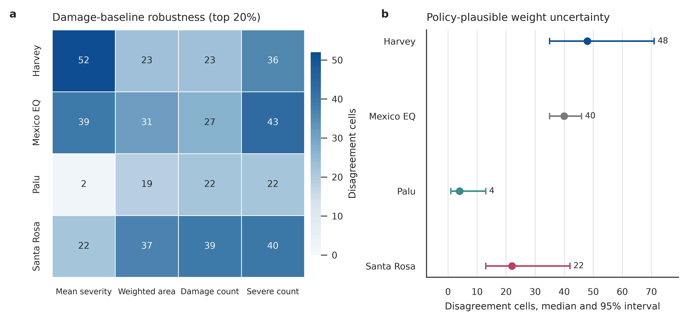

### 5.4 Scale and Population Products Are Material Sources of Uncertainty

The 100 m population analysis produced exact top-20% disagreement counts of 103, 52, and 27 for Harvey at 250, 500, and 1,000 m. Corresponding counts were 82, 39, and 9 for Mexico; 4, 2, and 1 for Palu; and 74, 22, and 7 for Santa Rosa. Area shares were more comparable than counts but still varied. Harvey ranged from 7.7% to 9.6%, Mexico from 6.8% to 13.5%, Palu from 0.8% to 1.2%, and Santa Rosa from 5.0% to 8.4%.

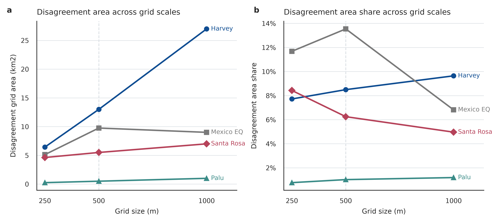

The population-resolution audit reinforced this caution. Although cell-rank correlations between WorldPop products exceeded 0.73 in every event, event totals differed by more than 25% in Harvey, Mexico, and Santa Rosa. The 100 m product was retained as the primary surface because it passed completeness checks and better matched the analytical grid, while the 1 km product remained an explicit robustness gate rather than being treated as interchangeable evidence.

### 5.5 Only Four Cells Pass Every Fixed Cross-Definition Gate

The fixed consensus gate sharply reduced the candidate set. Harvey, Palu, and Santa Rosa had no robust disagreement cells. Mexico retained four:

| Cell | Population, 1 km product | Population, 100 m product | Baselines supporting, both products | Policy probability, 1 km / 100 m | Common supported scales |
| --- | ---: | ---: | ---: | ---: | --- |
| `mexico-earthquake_500m_3_38` | 1,923.91 | 2,208.33 | 4 / 4 | 0.862 / 0.812 | 500 m, 1,000 m |
| `mexico-earthquake_500m_17_2` | 296.68 | 274.78 | 4 / 4 | 0.959 / 0.927 | 500 m, 1,000 m |
| `mexico-earthquake_500m_17_3` | 296.68 | 100.12 | 4 / 4 | 0.956 / 0.846 | 500 m, 1,000 m |
| `mexico-earthquake_500m_18_3` | 284.85 | 227.03 | 4 / 4 | 0.942 / 0.889 | 500 m, 1,000 m |

These cells are robust to the specified definitions, not validated as locations of unmet need. Their survival is noteworthy because the primary percentile rule produced zero Mexico disagreements; strict budgets and fixed cross-definition gates reveal a small subset within an otherwise weakly discriminating damage field.

### 5.6 NFIP Favors Physical-Damage Rankings on Rank Correlation

NFIP did not validate the multi-source scenarios as estimates of unmet need. For claim count over 149 tracts, damage severity reached Spearman rho 0.548 (95% bootstrap interval 0.430 to 0.653), compared with 0.420 (0.286 to 0.546) for the balanced multi-source scenario. For paid amount, the values were 0.591 (0.482 to 0.686) and 0.450 (0.304 to 0.572). The balanced scenario had a slightly higher paid-loss NDCG point estimate than primary damage severity (0.561 versus 0.510), but this did not overturn the correlation result. NFIP measures insured property loss, so stronger physical-damage alignment is coherent with the construct.

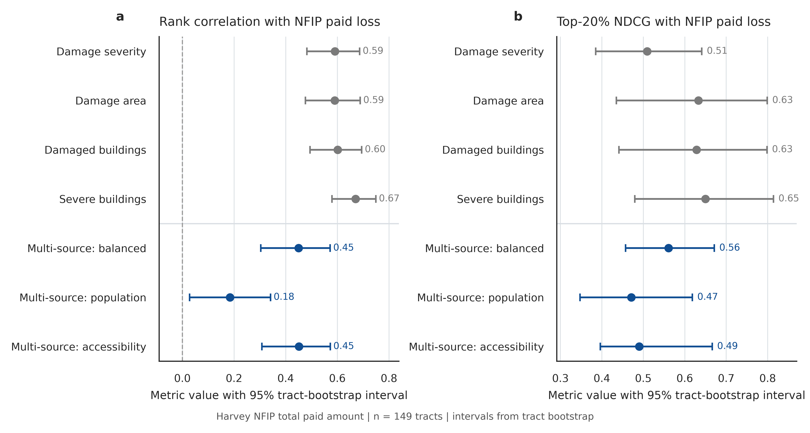

### 5.7 Historical OSM Does Not Support the Four Final Candidates

Historical OSM altered the interpretation. Santa Rosa had an event-level disagreement Jaccard of 0.536 and met the fixed support rule, but it had no cells that passed the cross-definition consensus gate. Mexico had a Jaccard of 0.333, so its temporal evidence was `does_not_support`. Palu was also unsupported at 0.400. Harvey was `not_assessable` because historical facility coverage reached 0.491 of current coverage, just below the fixed 0.50 threshold; the failure was not converted to a zero-valued result.

All four Mexico candidates were therefore marked `does_not_support` for historical persistence. The final evidence package contains four robust cross-definition disagreements and zero temporally supported robust disagreements.


### 5.8 External Proxies Disagree About the Preferred Priority Framing

The external tests did not identify one universally superior ranking. For overall CDC SVI across 149 tracts, damage severity had Spearman rho -0.144 (95% bootstrap interval -0.296 to 0.013), while the balanced multi-source scenario had 0.022 (-0.141 to 0.180). Neither showed decisive alignment.

At the RI-IHP 10% coverage threshold, only 14 ZIP codes remained. For valid registrations, damage severity reached 0.503 (-0.038 to 0.892), compared with 0.569 (-0.005 to 0.919) for the balanced scenario. For eligible assistance amount, the values were 0.851 (0.468 to 0.982) and 0.868 (0.507 to 0.959). For registrations per 1,000 WorldPop residents, they were 0.473 (-0.050 to 0.801) and 0.556 (0.089 to 0.862). The multi-source point estimates were slightly higher, but the intervals were wide and strongly overlapping. Together with the NFIP result, the proxy families did not identify one consistently superior framing.

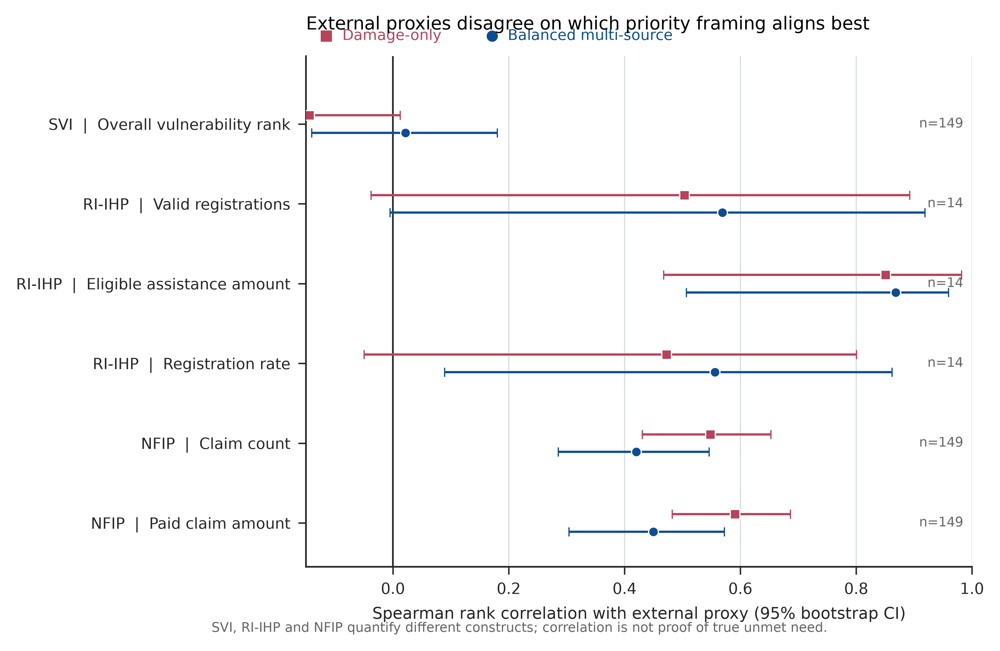

## 6. Discussion

The main scientific result is attrition, not the initial disagreement count. A damage-only ranking and multi-source scenarios frequently select different cells, but most apparent disagreements fail at least one test of damage definition, policy weighting, population resolution, or spatial scale. Four cells survive the fixed cross-definition gate, and none survives a separate historical OSM support test. This pattern is more informative than presenting all 73 or 115 provisional cells as equivalent findings.

The Mexico result illustrates why the audit must separate rank mechanics from substantive interpretation. Its xBD damage distribution contains extensive ties, so a percentile rule becomes operationally uninformative. Exact top-k budgets restore a fixed inspection constraint and reveal cells consistently selected by non-damage evidence. Yet historical OSM does not preserve those cell identities strongly enough to support temporal stability. The result is therefore a warning about damage-only ranking under weak damage discrimination, not a claim that the four cells should receive aid.

The external evidence further constrains interpretation. SVI represents background social vulnerability, RI-IHP represents program registrations and eligibility, and NFIP represents insured property loss. Their disagreement is expected because the constructs differ. NFIP's stronger alignment with physical damage is coherent with its insured-loss definition. Slight RI-IHP advantages for a balanced scenario are suggestive but not decisive because only 14 sufficiently covered ZIP codes enter the main comparison. An audit should expose this construct dependence rather than nominate whichever proxy produces the preferred result.

The analysis suggests three design principles for disaster-oriented urban AI. First, physical damage observation and resource-priority reasoning should remain separate layers. Second, policy choices should be represented as transparent scenarios and uncertainty distributions rather than hidden in one score. Third, a candidate should carry evidence flags for damage definition, weights, population product, spatial scale, temporal map support, and external construct alignment. Human analysts can then see why a cell was surfaced and where the evidence stops.

## 7. Human-AI Collaboration and Reproducibility

The competition evaluates both scientific value and the human-AI research process [@tsinghua2026urbancup]. AI assisted with question refinement, data-source discovery, script development, failure diagnosis, result checking, figure revision, and manuscript restructuring. Human decisions fixed the research boundary, rejected unsupported interpretations, selected conservative gates, required negative results to remain visible, and restricted public release to aggregate and licensed material.

Every substantive step is linked through four records: `logs/research_log.md`, `logs/ai_collaboration_log.md`, `logs/command_log.md`, and `records/evidence_index.csv`. The public artifact provides fixed configs, derived tables, source scripts, figure exports, data hashes, and a single reproduction entry point. The main resources are:

- `scripts/reproduce_core.py`: pinned download, hash verification, core recomputation, final-candidate checks, and figure regeneration;
- `configs/final_evidence.yaml`: fixed population, historical OSM, external proxy, and consensus rules;
- `src/18_run_baseline_weight_robustness.py`: damage-baseline and weight uncertainty;
- `src/19_run_multiscale_robustness.py`: independent grid reconstruction;
- `src/22_run_historical_osm_sensitivity.py`: pre-event OSM retrieval and sensitivity;
- `src/23_validate_svi_ihp.py`: SVI and single-table RI-IHP tests;
- `src/24_build_final_consensus.py`: fixed-gate consensus audit; and
- `src/21_regenerate_publication_figures.py`: deterministic regeneration of Figures 1--12 from released tables.

The analysis used the server conda environment `city` and CPU computation. Raw xBD imagery, raw WorldPop rasters, and individual FEMA records are not redistributed. Public derived evidence is available through the linked GitHub and Hugging Face repositories.

## 8. Resolved in This Submission

This submission resolves four weaknesses that would otherwise limit the audit. First, the primary population analysis now uses complete 100 m WorldPop rasters and retains the 1 km product as a documented sensitivity check. Second, every spatial-scale result is rebuilt from building-level records at 250, 500, and 1,000 m. Third, current OSM is compared with pre-event ohsome snapshots, with incomplete coverage marked `not_assessable`. Fourth, NFIP, SVI, and RI-IHP are all evaluated with bootstrap intervals, coverage, sample size, privacy-safe aggregation, and construct-specific interpretation.

The submission also fixes a reproducibility contract: exact top-k budgets, deterministic ties, fixed seed, 10,000 policy-weight samples, unchanged consensus thresholds, input hashes, editable vector figures, grayscale exports, and public source code. Negative and mixed findings remain in the main report.

## 9. Remaining Validity Boundaries

The central boundary is outcome validity. No available dataset directly measures true unmet rescue or recovery need across all four events. Robust disagreement therefore means stability across observable analytical choices, not correctness of an aid allocation.

xBD footprints and labels do not represent every damaged place within each disaster. Damage classes may contain interpretation error, and the four selected events do not support universal claims across hazards or cities. WorldPop products use different allocation methods and produce materially different totals. OSM completeness varies across place and time, while historical mapping density reflects contributor activity as well as the historical city.

The analysis is also subject to the modifiable areal unit problem. Independent scale reconstruction reduces dependence on one grid, but it cannot make cell identities scale-free. External overlays introduce tract and ZIP aggregation, insurance selection, program eligibility, and administrative participation. These are evidence boundaries, not defects that can be removed by stronger wording.

Finally, the priority scenarios are normative and transparent rather than learned from outcome labels. They are suitable for auditing disagreement and prompting human review. They are not suitable for automated rescue dispatch, benefit determination, or replacement of local field assessment.

## 10. Conclusion

Damage-only post-disaster rankings can disagree with multi-source priority scenarios, but the disagreement is highly sensitive to definitions and data. Across four xBD events, 73 percentile-rule and 115 exact-budget provisional cells narrowed to four robust cross-definition disagreements after fixed baseline, weight, population-resolution, and spatial-scale gates. Historical OSM did not support those four cells, and SVI, RI-IHP, and NFIP favored different priority framings. The defensible contribution is therefore an audit protocol: keep damage observation separate from policy scenarios, expose disagreements with their evidence flags, and route the surviving cases to human review without presenting them as measured unmet need.

## References

References are maintained in `reports/references.bib`.
